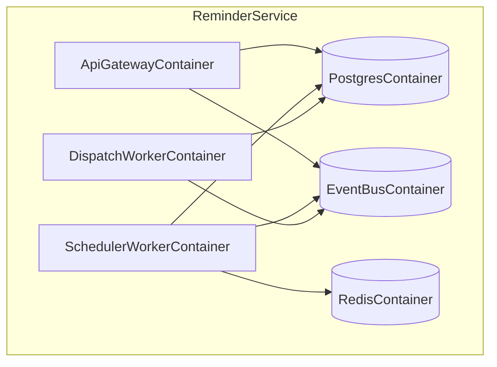

# 05 Building Block View

## Level 1 Blocks
- `ApiGatewayContainer`
- `SchedulerWorkerContainer`
- `DispatchWorkerContainer`
- `PostgresContainer`
- `RedisContainer`
- `EventBusContainer`

## Level 2 Internal Blocks
- domain: `Reminder`, `ScheduleRule`, `DispatchPolicy`
- application: `CreateReminderUseCase`, `SnoozeReminderUseCase`, `CancelReminderUseCase`
- infrastructure: `PostgresReminderRepository`, `RedisDueIndex`, `NatsEventPublisher`

## Diagram

