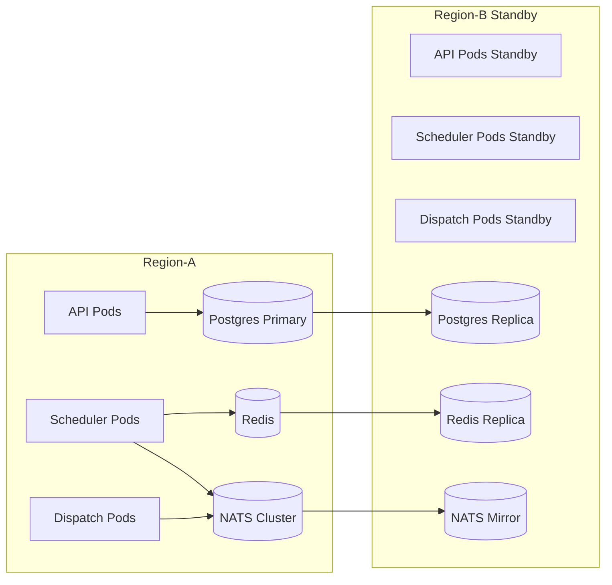

# 07 Deployment View

## Deployment Units
- API deployment
- Scheduler worker deployment
- Dispatch worker deployment
- Postgres stateful set / managed service
- Redis cache / managed service
- NATS cluster / managed service

## Platform Baseline
- Kubernetes multi-zone cluster
- Terraform-managed cloud resources
- Helm release per environment

## Deployment Diagram

