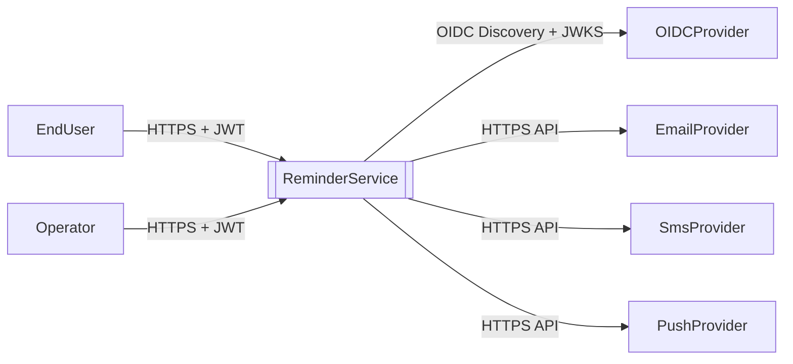
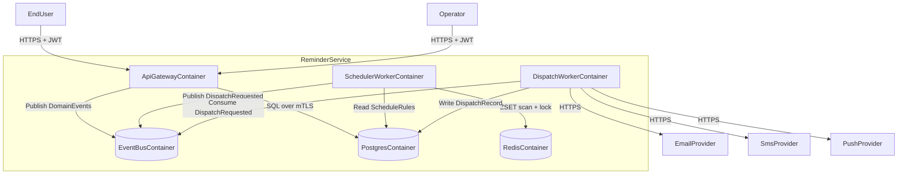

# System Overview

## Arc42 Mapping
- Section1: Introduction and Goals.
- Section3: Context and Scope.
- Section5: Building Block View.
- Section6: Runtime View.
- Section10: Quality Requirements.

## System Context (C4 Level 1)
- SystemUnderDesign: `ReminderService`.
- Responsibility: Persist schedules and trigger multi-channel notifications at deterministic times.

## Container View (C4 Level 2)
- `ApiGatewayContainer`: Validates JWT, enforces authz, accepts command/query traffic.
- `SchedulerWorkerContainer`: Pulls due reminders and emits dispatch commands.
- `DispatchWorkerContainer`: Sends notifications and records delivery outcomes.
- `PostgresContainer`: Source of truth for `Reminder`, `ScheduleRule`, `DispatchRecord`.
- `RedisContainer`: Due-time index and short-lived locks.
- `EventBusContainer`: Domain event transport for decoupled processing.

## Runtime Constraints
- TimeSource: All scheduling calculations use UTC; local timezone only at API boundary translation.
- Idempotency: `DispatchRecord(ReminderId, ScheduledAt, Channel)` unique key.
- Ordering: Per `ReminderId`, dispatch order must be monotonic by `ScheduledAt`.
- FailureHandling: Retries use bounded exponential backoff with jitter; max attempts = 12.

## Quality Requirements
| QualityAttribute | Budget | Measurement |
|---|---|---|
| CommandWriteLatencyP95 | <= 120 ms | API histogram `http.server.duration` |
| DueToDispatchLagP99 | <= 1,000 ms | `scheduler.dispatch.lag_ms` |
| DuplicateDispatchRate | < 0.01% | `dispatch.duplicate.count / dispatch.total` |
| DataLossRPO | <= 5 s | WAL + event outbox replication |
| RecoveryRTO | <= 15 min | regional failover drill |

## Security Architecture
- ExternalEdge: TLS termination with WAF and rate limits.
- InternalMesh: mTLS certificates rotated every 24 hours.
- TokenValidation: JWT signature and claim checks at `ApiGatewayContainer`.
- SecretHandling: Runtime fetch from secret manager; no static secrets in repo.
- AuditTrail: Append-only audit records for create/update/snooze/cancel operations.

## Scaling Strategy
- HorizontalScaleUnit: Tenant shard.
- ShardingRule: `ShardId = Hash(TenantId) mod N`.
- WorkerParallelism: Queue consumers scale independently by shard lag.
- HotShardMitigation: Adaptive rebalancing with virtual shards.
- CrossRegion: Active-passive failover with replay from outbox and durable event stream.
