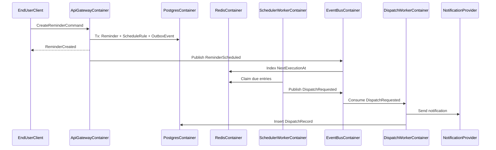
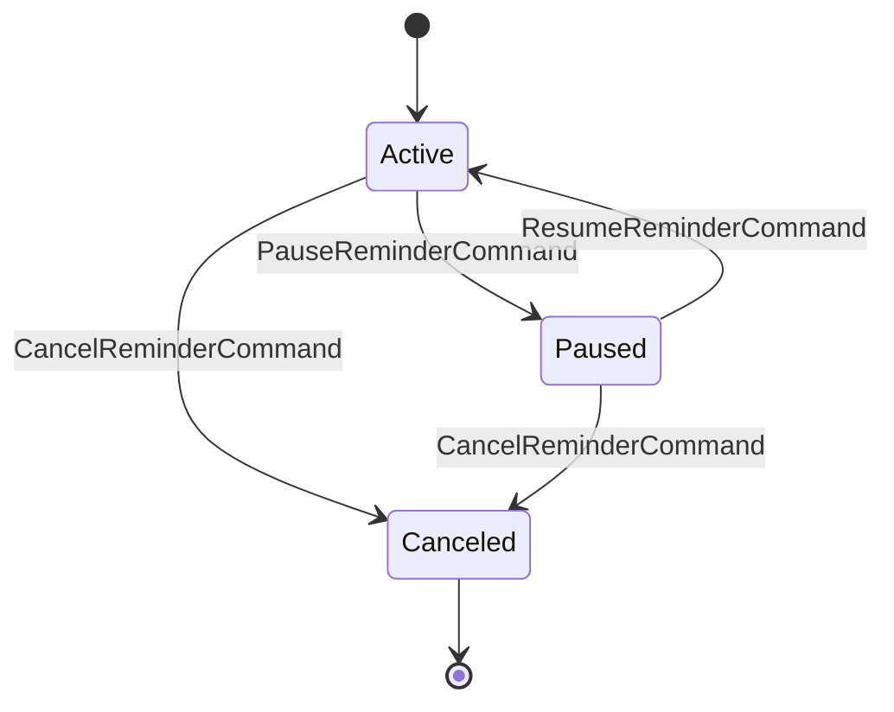

# RFC-0001 Core Logic

- Status: Draft
- Date: 2026-02-28
- Owners: ApplicationArchitectureGroup
- Reviewers: DomainTeam, SecurityTeam, SRETeam

## Executive Summary
Define deterministic scheduling and delivery for reminder notifications with strict idempotency, tenant isolation, and bounded retry behavior.

## Goals
- Guarantee deterministic `NextExecutionAt` for every `Reminder`.
- Dispatch due reminders with <= 1 second P99 lag.
- Prevent duplicate user-visible notifications under retries and failovers.
- Preserve complete audit trail for schedule mutations and dispatch attempts.

## Non-Goals
- End-user UI design.
- Provider-specific rich template rendering.
- Cross-product workflow orchestration beyond reminder domain.

## Domain Objects
- `Reminder`
  - `ReminderId` (UUID)
  - `TenantId` (UUID)
  - `UserId` (UUID)
  - `ReminderStatus` (`Active|Paused|Canceled`)
  - `Payload` (normalized message metadata)
- `ScheduleRule`
  - `ScheduleType` (`OneTime|Interval|Cron`)
  - `Timezone` (IANA TZDB identifier)
  - `StartAtLocal` (local datetime)
  - `IntervalSeconds` (for `Interval`)
  - `CronExpression` (for `Cron`)
- `DispatchRecord`
  - `ReminderId`
  - `ScheduledAt` (UTC instant)
  - `Channel` (`Email|Sms|Push`)
  - `Attempt`
  - `DispatchStatus` (`Sent|Failed|Aborted`)

## Invariants
- `ReminderStatus=Canceled` implies no future `DispatchRequested` events.
- `NextExecutionAt` must be strictly greater than `LastExecutionAt` for recurring rules.
- `Timezone` conversion occurs once at write-time normalization; runtime scheduler uses UTC only.
- Unique key on `DispatchRecord(ReminderId, ScheduledAt, Channel)` enforces idempotency.
- Every state transition emits an `AuditEvent` with actor identity and reason.

## API Contract Surface
- `CreateReminderCommand`
- `UpdateScheduleCommand`
- `SnoozeReminderCommand`
- `CancelReminderCommand`
- `GetReminderQuery`
- `ListRemindersQuery`

Reference: [API Contract](../../api/openapi/reminder-v1.yaml)

## Detailed Design

### Scheduling Algorithm
1. Accept command with local user schedule data.
2. Validate domain invariants (`Timezone`, `ScheduleType`, payload constraints).
3. Normalize to canonical UTC schedule representation.
4. Persist `Reminder` and `ScheduleRule` in one transaction.
5. Write `OutboxEvent(ReminderScheduled)` in same transaction.
6. Projector publishes due index entry to Redis ZSET score=`NextExecutionAtEpochMillis`.
7. SchedulerWorker executes periodic claim loop:
   - Query due IDs where score <= now.
   - Acquire short lock key `lock:dispatch:{ReminderId}:{ScheduledAt}` (TTL 30s).
   - Publish `DispatchRequested` event.
8. DispatchWorker resolves channels, sends provider requests, writes `DispatchRecord`.
9. If recurring and not canceled, calculate next UTC execution and re-index.

### Retry Policy
- Backoff: `Delay = min(Base * 2^Attempt, MaxDelay) + Jitter(0..250ms)`.
- `Base=500ms`, `MaxDelay=15m`, `MaxAttempts=12`.
- Permanent failure classes (`4xx validation`, `invalid destination`) do not retry.
- Transient failure classes (`5xx`, `timeout`, `rate limit`) retry with backoff.

### Concurrency Model
- Partition ownership by `ShardId = Hash(TenantId) mod N`.
- Single reminder dispatch lock per `(ReminderId, ScheduledAt)`.
- Worker concurrency scales by shard; no global mutex.
- Rebalancing uses virtual shard reassignment without full queue pause.

### Data Model Constraints
- `Reminder(TenantId, ReminderId)` primary key locality for shard routing.
- `ScheduleRule(ReminderId)` one-to-one with `Reminder`.
- `DispatchRecord` append-only; updates forbidden after terminal state.

## Runtime Sequence

## State Lifecycle

## NFR and SLO Alignment
| Capability | Target | Measurement |
|---|---|---|
| ScheduleDeterminism | 100% reproducible `NextExecutionAt` from persisted rule | deterministic simulation tests |
| DispatchLagP99 | <= 1,000 ms | `scheduler.dispatch.lag_ms` |
| DuplicateVisibleNotifications | <= 1 per 10,000,000 dispatches | idempotency audit job |
| Availability | 99.95% monthly | SLO burn-rate alerts |
| TenantIsolation | 0 cross-tenant data leaks | policy and penetration tests |

## Security Design
- Authentication: OIDC token introspection/JWKS validation with strict audience check.
- Authorization: Tenant and scope checks in command handlers.
- Transport: mTLS for internal traffic; TLS 1.3 for external.
- Data: PII minimization in payload; encrypted columns for sensitive fields.
- Audit: immutable audit stream retained 400 days.

## Observability
- Metrics:
  - `reminder.commands.accepted_total`
  - `scheduler.dispatch.lag_ms`
  - `dispatch.attempts_total`
  - `dispatch.failures_total`
- Tracing:
  - Trace IDs propagated from API to provider call.
- Logs:
  - JSON structured logs with `TenantId`, `ReminderId`, `ScheduledAt`, `TraceId`.

## Rollout Plan
1. PhaseA: Shadow scheduling (no provider sends, record-only mode).
2. PhaseB: Canary 1% tenant shards with duplicate detection guard.
3. PhaseC: 100% rollout after 7 days of SLO compliance.

## Open Questions
1. Whether push notification provider abstraction requires per-channel circuit breaker isolation.
2. Whether tenant-level quiet hours belong in domain core or policy adapter.

## Related Documents
- [System Overview](../architecture/system-overview.md)
- [ADR-0001 Base Architecture](../adr/0001-base-architecture.md)
- [README](../../README.md)
